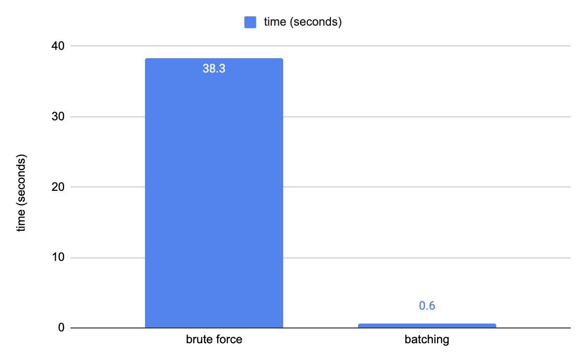
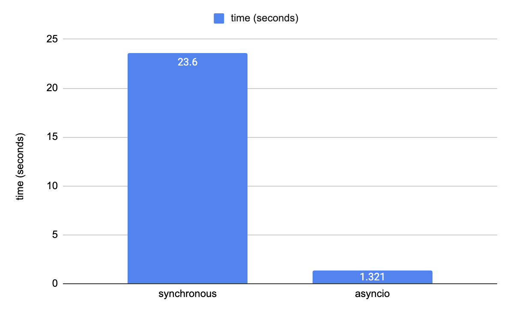

# How to run

1. Make a python virtual environment (tested to run at python 3.9.1)
```
python -m venv venv
source venv/bin/activate
```

2. Install required packages
```
pip install --upgrade pip
pip install -r requirements.txt
```

3. Run FastAPI server
```
uvicorn main:app --reload
```

# Sample request

- Each `query` should be in the format of `query={base_currency},{quote_currency},{date.Format(YYYY-MM-DD)}`.
- A single `query` or multiple `queries` can be included in the URL in the form of `URL parameters`.
- URL endpoint: `http://localhost:8000/currency-exchange/historical-rates/`

For example, when `queries` in the format of `({base_currency}, {quote_currency}, {date})` are like below,

```
query1 = ('USD', 'KRW', '2022-12-02')
query2 = ('USD', 'KRW', '2022-12-03')
query3 = ('USD', 'JPY', '2022-11-01')
```

the request URL is 
`http://localhost:8000/currency-exchange/historical-rates/?query=USD,KRW,2022-12-02&query=USD,KRW,2022-12-03&query=USD,JPY,2022-11-01`

------

# Tasks
1. Create a Python API server which provides currency exchange rates data.
    1. [x] initialize your application
    2. [x] create Oanda API client function and test it.
    3. [x] decide the url pattern for exchange rates data API
    4. [x] implement the API endpoint
    5. [x] test if the API endpoint works fine.
2. Write a brief documentation about the service.
    1. [x] How is it implemented
    2. [x] What problems can happen in the current implementation
    3. [x] How can it be improved in the future
    4. [x] Any other things that we should know about

# 1. How is it implemented?

- `date`: `Batching` technique has been applied to minimise the number of Oanda API queries when a request includes **multiple dates** for each currency pair.
- `currency`: `asyncio` has been used to optimise the performance by sending API calls asynchronously when a request includes **multiple currencies**.

1. Firstly, iterate through all the `queries` in the request URL.

    - For each `(base_currency, quote_currency)` pair, find the `minimum_date` and `maximum_date` and keep them in `currency_pair_to_interval` dictionary.

    - Also add `(base_currency, quote_currency, date)` tuple (called `key` in the codes) into `key_to_rate` dictionary as a key and an empty string as its value.

2. Using `currency_pair_to_interval` dictionary, send only one query to Oanda API per each currency pair (using `start_date` and `end_date` that covers all the requested dates). Do this asynchronously so that multiple currency pairs are fetched concurrently.

3. And among all the fetched historical rates, save only the rates for the requested keys into key-value dictionary `key_to_rate`.

4. Then iterate through the requested `keys` again, map each `rate` onto each `key` using `key_to_rate`. Then return mapped the `rates` in the same order as the requested `keys`.

## Performance comparison (date): brute force vs batch request
- When requesting 60 days' worth of data for `(base=USD and quote=KRW)` and `(base=USD, quote=JPY)` pairs. (total 120 rows)



  - **brute force** (120 Oanada API calls) : **avg 38.8s** (5 tries)
  - **batch processing** (2 Oanda API calls) : **avg 0.6s** (5 tries)
  - => (brute force method takes 65 times longer)

- request URL :
```
http://localhost:8000/currency-exchange/historical-rates/?query=USD,KRW,2022-10-01&query=USD,KRW,2022-10-02&query=USD,KRW,2022-10-03&query=USD,KRW,2022-10-04&query=USD,KRW,2022-10-05&query=USD,KRW,2022-10-06&query=USD,KRW,2022-10-07&query=USD,KRW,2022-10-08&query=USD,KRW,2022-10-09&query=USD,KRW,2022-10-10&query=USD,KRW,2022-10-11&query=USD,KRW,2022-10-12&query=USD,KRW,2022-10-13&query=USD,KRW,2022-10-14&query=USD,KRW,2022-10-15&query=USD,KRW,2022-10-16&query=USD,KRW,2022-10-17&query=USD,KRW,2022-10-18&query=USD,KRW,2022-10-19&query=USD,KRW,2022-10-20&query=USD,KRW,2022-10-21&query=USD,KRW,2022-10-22&query=USD,KRW,2022-10-23&query=USD,KRW,2022-10-24&query=USD,KRW,2022-10-25&query=USD,KRW,2022-10-26&query=USD,KRW,2022-10-27&query=USD,KRW,2022-10-28&query=USD,KRW,2022-10-29&query=USD,KRW,2022-10-30&query=USD,KRW,2022-10-31&query=USD,KRW,2022-11-01&query=USD,KRW,2022-11-02&query=USD,KRW,2022-11-03&query=USD,KRW,2022-11-04&query=USD,KRW,2022-11-05&query=USD,KRW,2022-11-06&query=USD,KRW,2022-11-07&query=USD,KRW,2022-11-08&query=USD,KRW,2022-11-09&query=USD,KRW,2022-11-10&query=USD,KRW,2022-11-11&query=USD,KRW,2022-11-12&query=USD,KRW,2022-11-13&query=USD,KRW,2022-11-14&query=USD,KRW,2022-11-15&query=USD,KRW,2022-11-16&query=USD,KRW,2022-11-17&query=USD,KRW,2022-11-18&query=USD,KRW,2022-11-19&query=USD,KRW,2022-11-20&query=USD,KRW,2022-11-21&query=USD,KRW,2022-11-22&query=USD,KRW,2022-11-23&query=USD,KRW,2022-11-24&query=USD,KRW,2022-11-25&query=USD,KRW,2022-11-26&query=USD,KRW,2022-11-27&query=USD,KRW,2022-11-28&query=USD,KRW,2022-11-29&query=USD,JPY,2022-10-01&query=USD,JPY,2022-10-02&query=USD,JPY,2022-10-03&query=USD,JPY,2022-10-04&query=USD,JPY,2022-10-05&query=USD,JPY,2022-10-06&query=USD,JPY,2022-10-07&query=USD,JPY,2022-10-08&query=USD,JPY,2022-10-09&query=USD,JPY,2022-10-10&query=USD,JPY,2022-10-11&query=USD,JPY,2022-10-12&query=USD,JPY,2022-10-13&query=USD,JPY,2022-10-14&query=USD,JPY,2022-10-15&query=USD,JPY,2022-10-16&query=USD,JPY,2022-10-17&query=USD,JPY,2022-10-18&query=USD,JPY,2022-10-19&query=USD,JPY,2022-10-20&query=USD,JPY,2022-10-21&query=USD,JPY,2022-10-22&query=USD,JPY,2022-10-23&query=USD,JPY,2022-10-24&query=USD,JPY,2022-10-25&query=USD,JPY,2022-10-26&query=USD,JPY,2022-10-27&query=USD,JPY,2022-10-28&query=USD,JPY,2022-10-29&query=USD,JPY,2022-10-30&query=USD,JPY,2022-10-31&query=USD,JPY,2022-11-01&query=USD,JPY,2022-11-02&query=USD,JPY,2022-11-03&query=USD,JPY,2022-11-04&query=USD,JPY,2022-11-05&query=USD,JPY,2022-11-06&query=USD,JPY,2022-11-07&query=USD,JPY,2022-11-08&query=USD,JPY,2022-11-09&query=USD,JPY,2022-11-10&query=USD,JPY,2022-11-11&query=USD,JPY,2022-11-12&query=USD,JPY,2022-11-13&query=USD,JPY,2022-11-14&query=USD,JPY,2022-11-15&query=USD,JPY,2022-11-16&query=USD,JPY,2022-11-17&query=USD,JPY,2022-11-18&query=USD,JPY,2022-11-19&query=USD,JPY,2022-11-20&query=USD,JPY,2022-11-21&query=USD,JPY,2022-11-22&query=USD,JPY,2022-11-23&query=USD,JPY,2022-11-24&query=USD,JPY,2022-11-25&query=USD,JPY,2022-11-26&query=USD,JPY,2022-11-27&query=USD,JPY,2022-11-28&query=USD,JPY,2022-11-29
```

## Performance comparison (currency pair): synchronous vs asyncio
- When requesting 98 currency pairs (total 98 rows)



  - **synchronous** (98 Oanda API calls) : **avg 23.6s** (5 tries)
  - **asyncio** (98 Oanda API calls asynchronously) : **avg 1.32** (5 tries)
  - => synchronous method takes 18 times longer
  - request URL: 
  ```
  http://localhost:8000/currency-exchange/historical-rates/?query=USD,ADP,2022-12-01&query=USD,AED,2022-12-01&query=USD,AFA,2022-12-01&query=USD,AFN,2022-12-01&query=USD,ALL,2022-12-01&query=USD,AMD,2022-12-01&query=USD,ANG,2022-12-01&query=USD,AOA,2022-12-01&query=USD,AON,2022-12-01&query=USD,ARS,2022-12-01&query=USD,ATS,2022-12-01&query=USD,AUD,2022-12-01&query=USD,AWG,2022-12-01&query=USD,AZM,2022-12-01&query=USD,AZN,2022-12-01&query=USD,BAM,2022-12-01&query=USD,BBD,2022-12-01&query=USD,BDT,2022-12-01&query=USD,BEF,2022-12-01&query=USD,BGL,2022-12-01&query=USD,BGN,2022-12-01&query=USD,BHD,2022-12-01&query=USD,BIF,2022-12-01&query=USD,BMD,2022-12-01&query=USD,BND,2022-12-01&query=USD,BOB,2022-12-01&query=USD,BRL,2022-12-01&query=USD,BSD,2022-12-01&query=USD,BTN,2022-12-01&query=USD,BWP,2022-12-01&query=USD,BYR,2022-12-01&query=USD,BZD,2022-12-01&query=USD,CAD,2022-12-01&query=USD,CDF,2022-12-01&query=USD,CHF,2022-12-01&query=USD,CLP,2022-12-01&query=USD,CNH,2022-12-01&query=USD,COP,2022-12-01&query=USD,CRC,2022-12-01&query=USD,CSK,2022-12-01&query=USD,CZK,2022-12-01&query=USD,CUP,2022-12-01&query=USD,CVE,2022-12-01&query=USD,CYP,2022-12-01&query=USD,DEM,2022-12-01&query=USD,DJF,2022-12-01&query=USD,DKK,2022-12-01&query=USD,DOP,2022-12-01&query=USD,DZD,2022-12-01&query=USD,ECS,2022-12-01&query=USD,EEK,2022-12-01&query=USD,EGP,2022-12-01&query=USD,ESP,2022-12-01&query=USD,ETB,2022-12-01&query=USD,EUR,2022-12-01&query=USD,FIM,2022-12-01&query=USD,FJD,2022-12-01&query=USD,FKP,2022-12-01&query=USD,FRF,2022-12-01&query=USD,GBP,2022-12-01&query=USD,GEL,2022-12-01&query=USD,GHC,2022-12-01&query=USD,GHS,2022-12-01&query=USD,GIP,2022-12-01&query=USD,GMD,2022-12-01&query=USD,GNF,2022-12-01&query=USD,GRD,2022-12-01&query=USD,GTQ,2022-12-01&query=USD,GYD,2022-12-01&query=USD,HKD,2022-12-01&query=USD,HNL,2022-12-01&query=USD,HRK,2022-12-01&query=USD,HTG,2022-12-01&query=USD,HUF,2022-12-01&query=USD,IDR,2022-12-01&query=USD,IEP,2022-12-01&query=USD,ILS,2022-12-01&query=USD,INR,2022-12-01&query=USD,IQD,2022-12-01&query=USD,IRR,2022-12-01&query=USD,ISK,2022-12-01&query=USD,ITL,2022-12-01&query=USD,JMD,2022-12-01&query=USD,JOD,2022-12-01&query=USD,JPY,2022-12-01&query=USD,KES,2022-12-01&query=USD,KGS,2022-12-01&query=USD,KHR,2022-12-01&query=USD,KMF,2022-12-01&query=USD,KPW,2022-12-01&query=USD,KRW,2022-12-01&query=USD,KWD,2022-12-01&query=USD,KYD,2022-12-01&query=USD,KZT,2022-12-01&query=USD,LAK,2022-12-01&query=USD,LBP,2022-12-01&query=USD,LKR,2022-12-01
  ```

# 2. What problems can happen in the current implementation?

1) Currently, Oanda API returns only for the last 180 days' data, without a specific interval limit (difference between `start_date` and `end_date`). But such API in the real world is likely to have a limit on the interval.
    - In such cases, let's say, maximum interval of 1 year between `start_date` and `end_date`, then I will need to divide the request into smaller pieces to fit into the limit.

2) If the requested dates are very far from each other, it may be inefficient to use `minimum_date` and `maximum_date`
    - For example, if `query1=USD,KRW,1980-01-01`, `query2=USD,KRW,2022-01-01`, then we are fetching 42 years' (42 years * 365 days = 15330 days) worth of data, while we only need 2 days' data.
    - This can be handled together with the above issue 1) since they are related

3) Many async calls => can exceed the rate limit of such API, since we are requesting multiple calls within a short time period (more than synchronous method)
    - Apply some kind of rate limit mechanism for the external API call (Oanda API in this case)

4) If the fetched data from Oanda API is too big, then we can have out of memory error. (but since 1 year worth of historical rates data only occupies 12kb. 100 year data will only be 1.2MB, so not likely a problem in the current situation)

5) Currently we are iterating through all the rates fetched from Oanda API
    - If it takes too long, we can consider using indexes of the requested dates (using date difference from `start_date` and `requested_date`, we don't need to iterate through all the dates, but just access the dates that we need)
    - But it will add reduce the readability of the codes. I didn't implement this because the advantage doesn't outweigh the cost at this stage.

# 3. How can it be improved in the future? (Any further improvements)

- By pre-saving all ISO currency codes in a hash set, I can validate currency code before sending request to Oanda API
    - It will contribute further to reduce the Oanda API calls for invalid requests
    - But it will come with a performance loss
    - Assuming that most requests have valid currency codes, I didn't implement this for now.

- DB saving (caching): 
    - If making a call to Oanda API costs significantly high
    - Or this microservice's response time is critical and Oanda API call is a major bottleneck
    - => Then it will make sense to cache all or popular key-value pairs into DB.
    - I didn't implement this because I didn't think it was the point of this assignment. If caching was an important part of this assignment, then it would be better for this microservice to just download the whole historical data into a DB and query from there.
    - But Oanda API call in this assignment looked more like a DB query in the real world to me. So I thought the point of this assignment is rather to optimise on the querying part, rather than to cache the query result.

# 4. Any other things that we should know about?

- Which one is more expensive: Oanda API call or saving data & querying from DB?
- Assuming that we are using a paid API service rather than Oanda public API, how is the cost for the API decided? By the number of API calls? Or the number of dates requested? Or the size of a response?
- Assuming we are using a paid API service that provides the rates of many decades (instead of 180 days in Oanda public API), what is the maximum interval limit between `start_date` and `end_date`?
- Is it okay to return the `rates` in `string` format? 
    - => I chose `string` because the Oanda API was returning rates in string, and an empty string for the invalid dates (outside the last 180 days).
    - => If `float` or `decimal` is required for the output format, empty string is likely to change to `null`.
